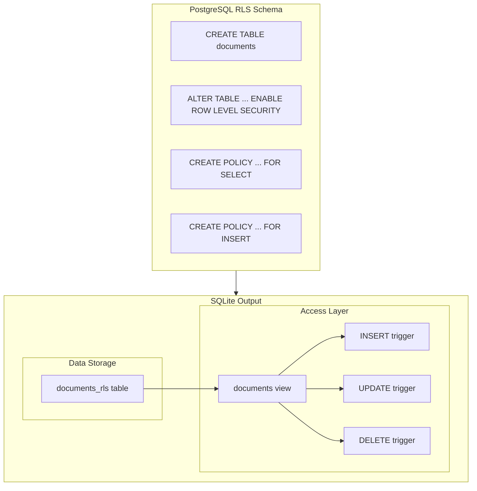
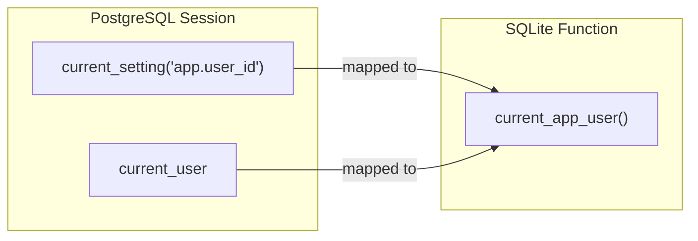
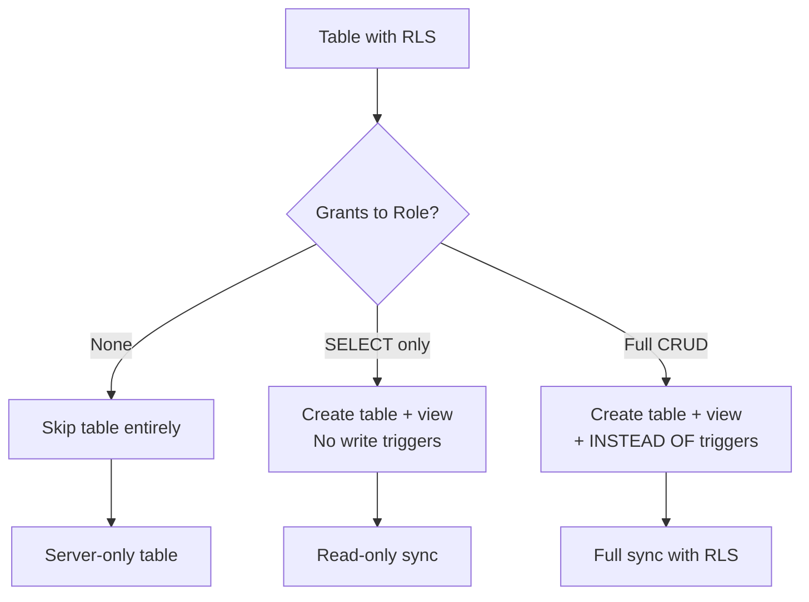
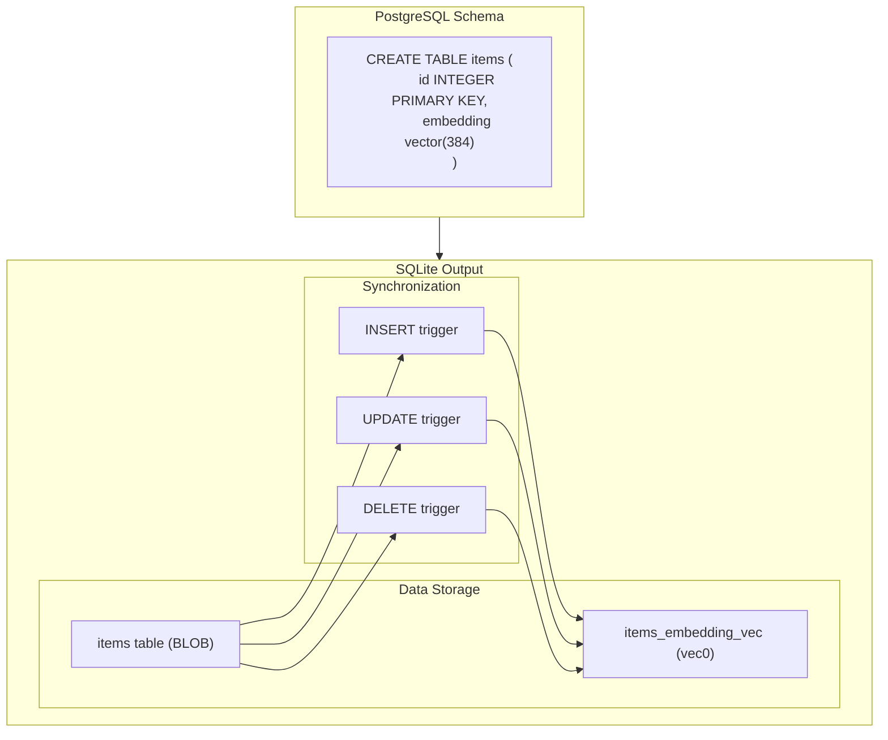

# pg2sqlite

[](https://github.com/LucaCappelletti94/pg2sqlite/actions)
[](https://github.com/LucaCappelletti94/pg2sqlite/actions)
[](https://opensource.org/licenses/MIT)
[](https://codecov.io/gh/LucaCappelletti94/pg2sqlite)

A Rust library to translate `PostgreSQL` SQL schemas and migrations into `SQLite`-compatible SQL.

This crate uses [`sqlparser`](https://github.com/apache/datafusion-sqlparser-rs) to parse `PostgreSQL`-dialect statements and then translates them into their `SQLite` equivalents, handling data type conversions, syntax and semantical differences.

## Features

### Statement Translation

Converts `PostgreSQL` statements to `SQLite`:

- `CREATE TABLE` — with automatic type mapping and `STRICT` tables
- `CREATE INDEX`
- `CREATE TRIGGER` — including PL/pgSQL function bodies
- `INSERT` — with `ON CONFLICT DO NOTHING` → `OR IGNORE`
- `UPDATE` and `DELETE` — including `DELETE ... USING` syntax
- `ALTER TABLE ENABLE ROW LEVEL SECURITY`
- `CREATE POLICY`
- `CREATE ROLE`
- `GRANT` / `REVOKE`

### Type Mapping

Automatically maps `PostgreSQL` types to `SQLite` types:

| PostgreSQL | SQLite |
|------------|--------|
| `SERIAL` / `SMALLSERIAL` | `INTEGER` |
| `UUID` / `BYTEA` | `BLOB` |
| `BOOLEAN` | `INTEGER` |
| `TIMESTAMP` / `TIMESTAMPTZ` | `TEXT` |
| `GEOGRAPHY` | `BLOB` |

### Primary Keys

Automatically adds `NOT NULL` to all Primary Key columns.

### UUID Generation

Translates `PostgreSQL` UUID default expressions to a configurable SQLite function call:

- `gen_random_uuid()` / `uuidv4()` / `uuidv7()` → calls your configured UUID function
- Configurable representation as `BLOB` (16 bytes) or `TEXT` (36 chars)
- Configurable extension function name (e.g., `uuid`, `uuidv7`, etc.)

### Row-Level Security (RLS)

Translates `PostgreSQL` RLS policies to `SQLite` using views and `INSTEAD OF` triggers:

1. **Table renaming**: The original table is renamed with a suffix (default `_rls`)
2. **View creation**: A view with the original table name filters rows based on policies
3. **INSTEAD OF triggers**: Enforce `INSERT`, `UPDATE`, and `DELETE` policies



Session variables are mapped from PostgreSQL patterns to SQLite functions:



### Roles and Grants

Parses and uses `CREATE ROLE` and `GRANT` statements to determine table accessibility:

- **No grants**: Table is excluded from translation (server-only tables)
- **SELECT only**: Table and view created without write triggers (read-only sync)
- **Full CRUD grants**: Complete RLS treatment with `INSTEAD OF` triggers



This enables generating SQLite schemas tailored to a specific role's permissions, ideal for client-side replicas that should only see/modify data they're authorized to access.

### Vector Search (pgvector → sqlite-vec)

Translates `PostgreSQL` pgvector types and operations to sqlite-vec equivalents:

#### Vector Types

| PostgreSQL | SQLite |
|------------|--------|
| `vector(N)` | `BLOB` |
| `halfvec(N)` | `BLOB` |

#### Distance Operators

| PostgreSQL | sqlite-vec |
|------------|------------|
| `<->` (L2 distance) | `vec_distance_L2()` |
| `<=>` (cosine distance) | `vec_distance_cosine()` |

#### Type Casts

| PostgreSQL | sqlite-vec |
|------------|------------|
| `'[1,2,3]'::vector` | `vec_f32('[1,2,3]')` |
| `'[1,2,3]'::halfvec` | `vec_f32('[1,2,3]')` |

#### vec0 Virtual Table Generation

For tables with vector columns, pg2sqlite generates:

1. **Main table** with vector columns as `BLOB`
2. **vec0 virtual table** for optimized vector operations
3. **Sync triggers** to keep the vec0 table synchronized



#### Performance Limitation

> **Important:** As of sqlite-vec v0.1.x, vec0 uses **brute-force search only** (O(n)), not ANN indexing like pgvector's HNSW/IVFFlat (O(log n)). For large datasets (>100k vectors), this may be slower than pgvector.
>
> ANN support is actively being developed: [sqlite-vec#25](https://github.com/asg017/sqlite-vec/issues/25)

The translation is correct and will automatically benefit when ANN is added. In the meantime, consider:

- Binary quantization (`vec_quantize_binary()`) for ~25x constant factor speedup
- Pre-filtering with `WHERE` clauses to reduce scan size
- Keeping datasets under 100k vectors for acceptable latency

### Window Functions

Window functions are supported in SQLite 3.25+ with identical syntax to PostgreSQL, so most translations are pass-through:

| Function | Status | Notes |
|----------|--------|-------|
| `ROW_NUMBER() OVER (...)` | Pass-through | |
| `RANK() OVER (...)` | Pass-through | |
| `DENSE_RANK() OVER (...)` | Pass-through | |
| `NTILE(n) OVER (...)` | Pass-through | |
| `LAG(col, n, default) OVER (...)` | Pass-through | |
| `LEAD(col, n, default) OVER (...)` | Pass-through | |
| `FIRST_VALUE(col) OVER (...)` | Pass-through | |
| `LAST_VALUE(col) OVER (...)` | Pass-through | |
| `NTH_VALUE(col, n) OVER (...)` | Pass-through | |
| `SUM/AVG/COUNT OVER (...)` | Pass-through | Aggregates as windows |
| `ROWS BETWEEN ...` | Pass-through | Frame clauses |
| `RANGE BETWEEN ...` | Pass-through | Frame clauses |
| `FILTER (WHERE ...)` | Error | Not supported in SQLite |

#### FILTER Clause Limitation

The `FILTER` clause is a PostgreSQL-specific feature not supported in SQLite:

```sql
-- PostgreSQL only (not supported)
SELECT COUNT(*) FILTER (WHERE status = 'active') OVER (PARTITION BY dept)

-- Equivalent SQLite-compatible syntax
SELECT SUM(CASE WHEN status = 'active' THEN 1 ELSE 0 END) OVER (PARTITION BY dept)
```

When a `FILTER` clause is detected, pg2sqlite returns an `UnsupportedSQLiteFeature` error with a helpful message suggesting the CASE expression alternative.

### PL/pgSQL Trigger Translation

Translates `PostgreSQL` PL/pgSQL trigger functions to `SQLite` trigger bodies:

- Variable declarations and assignments
- `IF`/`ELSIF`/`ELSE` conditionals
- `SELECT INTO` variable binding
- `NEW` and `OLD` record references
- `RAISE EXCEPTION` → `SELECT RAISE(ABORT, ...)`

### Migration Loading

- Parse raw SQL strings
- Read individual SQL files
- Recursively load `up.sql` migration files from a directory
- **Git Integration**: Clone a git repository and load `up.sql` migrations directly

## Usage

### Basic Translation

```rust
use pg2sqlite::prelude::*;

fn main() -> Result<(), Box<dyn std::error::Error>> {
    let pg_sql = r#"
        CREATE TABLE users (
            id SERIAL PRIMARY KEY,
            username TEXT NOT NULL
        );
        INSERT INTO users (username) VALUES ('alice') ON CONFLICT DO NOTHING;
    "#;

    let sqlite_statements = Pg2Sqlite::default()
        .sql(pg_sql)?
        .translate(&Pg2SqliteOptions::default())?;

    assert_eq!(sqlite_statements.len(), 2);

    let create_table = &sqlite_statements[0];
    assert_eq!(create_table.to_string(), "CREATE TABLE users (id INTEGER PRIMARY KEY NOT NULL, username TEXT NOT NULL) STRICT");

    let insert = &sqlite_statements[1];
    assert_eq!(insert.to_string(), "INSERT OR IGNORE INTO users (username) VALUES ('alice')");

    Ok(())
}
```

### RLS Translation with Session Variables

```rust
use pg2sqlite::prelude::*;

fn main() -> Result<(), Box<dyn std::error::Error>> {
    let pg_sql = r#"
        CREATE TABLE documents (
            id UUID PRIMARY KEY DEFAULT uuidv7(),
            owner_id UUID NOT NULL,
            title TEXT NOT NULL
        );
        ALTER TABLE documents ENABLE ROW LEVEL SECURITY;
        CREATE POLICY documents_select ON documents
            FOR SELECT USING (owner_id = current_setting('app.user_id')::uuid);
        CREATE POLICY documents_insert ON documents
            FOR INSERT WITH CHECK (owner_id = current_setting('app.user_id')::uuid);
    "#;

    let options = Pg2SqliteOptions::default()
        .with_uuid_representation(UuidRepresentation::Blob)
        .with_uuid_function_name("uuidv7".to_string())
        .with_session_user_role("authenticated")
        .with_session_variable(SessionVariableMapping::current_setting(
            "app.user_id",
            "current_app_user",  // Your SQLite function that returns the current user ID
        ));

    let sqlite_statements = Pg2Sqlite::default()
        .sql(pg_sql)?
        .translate(&options)?;

    // Results in:
    // 1. CREATE TABLE documents_rls (...) STRICT
    // 2. CREATE VIEW documents AS SELECT ... FROM documents_rls WHERE owner_id = current_app_user()
    // 3. CREATE TRIGGER documents_insert_trigger INSTEAD OF INSERT ON documents ...

    Ok(())
}
```

### Grant-Based Filtering

```rust
use pg2sqlite::prelude::*;

fn main() -> Result<(), Box<dyn std::error::Error>> {
    let pg_sql = r#"
        CREATE ROLE app_user;

        -- Server-only table (no grants to app_user)
        CREATE TABLE audit_logs (id UUID PRIMARY KEY, event TEXT);

        -- Read-only reference table
        CREATE TABLE users (id UUID PRIMARY KEY, name TEXT);
        GRANT SELECT ON users TO app_user;

        -- User-writable table
        CREATE TABLE posts (id UUID PRIMARY KEY, author_id UUID, content TEXT);
        GRANT SELECT, INSERT, UPDATE, DELETE ON posts TO app_user;
    "#;

    let options = Pg2SqliteOptions::default()
        .with_uuid_representation(UuidRepresentation::Blob)
        .with_session_user_role("app_user");  // Filter based on this role's grants

    let sqlite_statements = Pg2Sqlite::default()
        .sql(pg_sql)?
        .translate(&options)?;

    // Results in:
    // - audit_logs: NOT created (no grants to app_user)
    // - users: Created as read-only (SELECT only)
    // - posts: Created with full RLS triggers (full CRUD)

    Ok(())
}
```
