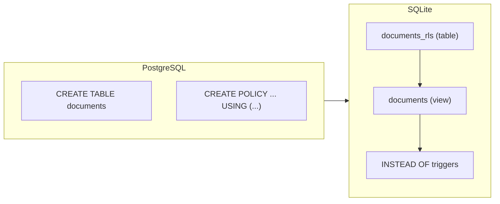

# pg2sqlite

[](https://github.com/LucaCappelletti94/pg2sqlite/actions)
[](https://github.com/LucaCappelletti94/pg2sqlite/actions)
[](https://opensource.org/licenses/MIT)
[](https://codecov.io/gh/LucaCappelletti94/pg2sqlite)

A Rust library that translates PostgreSQL SQL into valid, runnable SQLite SQL.

It parses PostgreSQL-dialect statements using [`sqlparser`](https://github.com/apache/datafusion-sqlparser-rs) and emits semantically equivalent SQLite SQL. Beyond basic type and syntax rewriting it handles complex PostgreSQL features that have no direct SQLite counterpart:

- **Row-Level Security** - `CREATE POLICY` / `ALTER TABLE ... ENABLE ROW LEVEL SECURITY` is translated to a renamed backing table, a view that enforces the `USING` clause, and `INSTEAD OF` triggers.
- **Full-text search** - `CREATE INDEX ... USING GIN (to_tsvector(...))` becomes an FTS5 virtual table with `AFTER INSERT / DELETE / UPDATE` sync triggers.
- **Vector search** - pgvector types (`vector`, `halfvec`) and distance operators (`<->`, `<=>`) are translated to [sqlite-vec](https://github.com/asg017/sqlite-vec) equivalents, including a `vec0` virtual table and sync triggers.
- **PL/pgSQL triggers** - trigger function bodies are parsed and rewritten to SQLite trigger syntax, including `IF / ELSIF / ELSE`, `SELECT INTO`, `RAISE EXCEPTION`, and `NEW` / `OLD` references.
- **Grant-based filtering** - when a session role is configured, tables and indices the role cannot access are omitted from the output entirely.
- **Reverse translation** - SQLite DML (`INSERT`, `UPDATE`, `DELETE`, `SELECT`) can be translated back to PostgreSQL for syncing client-side replicas to a PostgreSQL server.

> [!IMPORTANT]
> **Translation guarantees:** every output statement is valid SQLite. If a construct can be translated, it is. If it cannot, the call returns an explicit `Err`. *Silently skipped* statements (`CREATE FUNCTION`, `GRANT`, `CREATE ROLE`, ...) carry no SQLite-representable information. *Silently dropped* column options (`COLLATION`, `CHARACTER SET`, `COMMENT`) have no SQLite equivalent. Everything else either translates or errors - there are no silent pass-throughs that look valid but fail at runtime.

In our test suite, translated SQL is executed against SQLite via Diesel to verify runtime behavior, not just output SQL strings.

## Quick start

```rust
use pg2sqlite::prelude::*;

fn main() -> Result<(), Box<dyn std::error::Error>> {
    let pg_sql = "
        CREATE TABLE users (
            id SERIAL PRIMARY KEY,
            username TEXT NOT NULL
        );
        INSERT INTO users (username) VALUES ('alice') ON CONFLICT DO NOTHING;
    ";

    let sqlite_statements = Pg2Sqlite::default()
        .sql(pg_sql)?
        .translate(&Pg2SqliteOptions::default())?;

    assert_eq!(sqlite_statements.len(), 2);
    assert_eq!(
        sqlite_statements[0].to_string(),
        "CREATE TABLE users (id INTEGER PRIMARY KEY NOT NULL, username TEXT NOT NULL) STRICT"
    );
    assert_eq!(
        sqlite_statements[1].to_string(),
        "INSERT OR IGNORE INTO users (username) VALUES ('alice')"
    );

    Ok(())
}
```

## Features

### Statement translation

| PostgreSQL                                             | SQLite                                                                             |
| ------------------------------------------------------ | ----------------------------------------------------------------------------------- |
| `CREATE TABLE`                                         | Translated with `STRICT` mode and automatic type mapping                            |
| `CREATE INDEX`                                         | Translated (including `CREATE INDEX IF NOT EXISTS`)                                 |
| `CREATE TRIGGER`                                       | PL/pgSQL function bodies translated to SQLite trigger syntax                        |
| `CREATE VIEW`                                          | Translated. `CREATE OR REPLACE VIEW` becomes `DROP VIEW IF EXISTS` + `CREATE VIEW`  |
| `INSERT`                                               | `ON CONFLICT DO NOTHING` becomes `OR IGNORE`. `ON CONFLICT DO UPDATE SET ...` preserved as SQLite upsert (SQLite >= 3.24) |
| `UPDATE` / `DELETE`                                    | Including `DELETE ... USING` syntax                                                 |
| `DROP TABLE` / `DROP VIEW` / `DROP INDEX`              | Strips `CASCADE` / `RESTRICT`                                                       |
| `ALTER TABLE ENABLE ROW LEVEL SECURITY`                | Translated to views + `INSTEAD OF` triggers (see [RLS](#row-level-security))        |
| `CREATE POLICY` / `CREATE ROLE` / `GRANT` / `REVOKE`   | Consumed for RLS and grant-based filtering. No invalid output emitted               |

Statements with no SQLite equivalent (`CREATE FUNCTION`, `CREATE EXTENSION`, `CREATE SEQUENCE`, `ALTER ROLE`, `COPY`, etc.) are silently skipped - they carry no information that can be represented in SQLite.

Statements that *do* have a SQLite equivalent but that pg2sqlite does not yet translate (`STDDEV`, `PERCENTILE_CONT`, `ARRAY_AGG`, `REGEXP_REPLACE`, ...) return an explicit `Err` with a descriptive message. A clear error is always better than output that silently computes the wrong result or fails at runtime.

### Type mapping

| PostgreSQL                                                   | SQLite                                        |
| ------------------------------------------------------------ | --------------------------------------------- |
| `SERIAL` / `SMALLSERIAL` / `SMALLINT` / `INT` / `BOOLEAN`    | `INTEGER`                                     |
| `BIGINT` / `INT8` / `INT4` / `INT2`                          | `INTEGER`                                     |
| `FLOAT` / `DOUBLE PRECISION` / `FLOAT8` / `FLOAT4`           | `REAL`                                        |
| `NUMERIC` / `DECIMAL`                                        | `REAL` (lossy - precision not enforced)       |
| `VARCHAR` / `CHAR` / `TEXT` / `CLOB` / `NVARCHAR`            | `TEXT`                                        |
| `JSON` / `JSONB` / `TSVECTOR` / `TSQUERY`                    | `TEXT`                                        |
| `TIMESTAMP` / `TIMESTAMPTZ` / `DATE` / `TIME` / `INTERVAL`   | `TEXT`                                        |
| `UUID`                                                       | `BLOB` or `TEXT` (configurable)               |
| `BYTEA` / `BINARY` / `VARBINARY`                             | `BLOB`                                        |
| `BIT` / `BIT VARYING`                                        | `INTEGER`                                     |
| `vector(N)` / `halfvec(N)`                                   | `BLOB` (see [Vector search](#vector-search))  |
| `GEOMETRY` / `GEOGRAPHY`                                     | `BLOB` (see [PostGIS](#postgis-via-geolite))  |

All `CREATE TABLE` output uses SQLite `STRICT` mode, and `NOT NULL` is automatically added to primary key columns.

### Function translation

| PostgreSQL                         | SQLite                                                   |
| ---------------------------------- | -------------------------------------------------------- |
| `NOW()`                            | `datetime('now')`                                        |
| `CURRENT_TIMESTAMP`                | `CURRENT_TIMESTAMP` (SQLite keyword, preserved as-is)    |
| `EXTRACT(YEAR FROM x)`             | `CAST(strftime('%Y', x) AS INTEGER)`                     |
| `EXTRACT(EPOCH FROM x)`            | `CAST(strftime('%s', x) AS REAL)`                        |
| `DATE_TRUNC('month', x)`           | `strftime('%Y-%m-01', x)`                                |
| `CONCAT(a, b, c)`                  | `COALESCE(a,'') \|\| COALESCE(b,'') \|\| COALESCE(c,'')` |
| `STRING_AGG(x, sep)`               | `GROUP_CONCAT(x, sep)`                                   |
| `JSON_AGG(x)` / `JSONB_AGG(x)`     | `json_group_array(x)`                                    |
| `JSON_OBJECT_AGG(k, v)`            | `json_group_object(k, v)`                                |
| `CHAR_LENGTH(x)`                   | `length(x)`                                              |
| `STRPOS(s, sub)`                   | `instr(s, sub)`                                          |
| `POSITION(sub IN s)`               | `instr(s, sub)`                                          |
| `SUBSTRING(s FROM n FOR l)`        | `substr(s, n, l)`                                        |
| `ILIKE`                            | `lower(x) LIKE lower(pattern)`                           |
| `data->'field'` / `data->>'field'` | Preserved as-is (SQLite ≥ 3.38 native JSON operators)    |
| `x IS DISTINCT FROM y`             | `NOT (x IS y)`                                           |
| `x IS NOT DISTINCT FROM y`         | `x IS y`                                                 |

### Limitations

| Category                        | Examples                                                                         | Behavior                                             |
| ------------------------------- | -------------------------------------------------------------------------------- | ---------------------------------------------------- |
| Untranslatable SQL              | `STDDEV`, `PERCENTILE_CONT`, `ARRAY_AGG`, `REGEXP_REPLACE`, `#>`, `#>>`         | Returns `Err` with a descriptive message             |
| Silently skipped statements     | `CREATE FUNCTION`, `CREATE EXTENSION`, `CREATE SEQUENCE`, `GRANT`, `REVOKE`, `CREATE ROLE`, `COPY` | Silently omitted - carry no SQLite-representable information |
| Silently dropped column options | `COLLATION`, `CHARACTER SET`, `COMMENT`                                          | Dropped - no SQLite equivalent                       |

### UUID generation

**UUID translation requires explicit configuration.** Set `.with_uuid_representation(...)` to choose `UuidRepresentation::Blob` (16 bytes) or `UuidRepresentation::Text` (36-character strings). UUID default functions (`gen_random_uuid()`, `uuidv7()`, ...) are always renamed to the function configured via `.with_uuid_function_name()`.

PostgreSQL UUID defaults (`gen_random_uuid()`, `uuidv4()`, `uuidv7()`) are translated to a configurable SQLite function call. Ensure that function exists at runtime (for example, a registered SQLite UDF), and that its runtime return type matches the selected UUID representation.

Compatibility contract:

1. `UuidRepresentation::Blob` expects the configured UUID function to return a 16-byte SQLite `BLOB`.
2. `UuidRepresentation::Text` expects the configured UUID function to return SQLite `TEXT` (typically canonical UUID strings).
3. The translator rewrites function names but cannot inspect SQLite UDF implementations or infer their runtime return type.

Configuration matrix:

| Representation | UUID function return type | Result |
| --- | --- | --- |
| `Blob` | `BLOB` | Valid |
| `Text` | `TEXT` | Valid |
| `Text` | `BLOB` | Runtime insert/type error in `STRICT` tables |
| `Blob` | `TEXT` | Runtime type mismatch or unexpected storage semantics |

```rust
use pg2sqlite::prelude::*;

fn main() {
    let options = Pg2SqliteOptions::default()
        .with_uuid_representation(UuidRepresentation::Blob)
        .with_uuid_function_name("uuidv7".to_string());
    let _ = options;
}
```

Troubleshooting (`STRICT` tables):

- Symptom: insert fails with an error like `cannot store BLOB value in TEXT column ...`
- Cause: `UuidRepresentation::Text` is configured, but the runtime UUID function returns `BLOB`.
- Fix: use a text-returning UUID UDF for `Text` representation, or switch representation to `Blob`.

### Row-Level Security

PostgreSQL RLS policies are translated to SQLite using views and `INSTEAD OF` triggers:

1. The original table is renamed with a configurable suffix (default: `_rls`)
2. A view with the original table name filters rows based on policy `USING` clauses
3. `INSTEAD OF` triggers enforce `INSERT`, `UPDATE`, and `DELETE` policies



PostgreSQL session variables are mapped to SQLite function calls:

| PostgreSQL                       | SQLite                              |
| -------------------------------- | ----------------------------------- |
| `current_setting('app.user_id')` | `current_app_user()` (configurable) |
| `current_user`                   | `current_app_user()` (configurable) |

```rust
use pg2sqlite::prelude::*;

fn main() {
    let options = Pg2SqliteOptions::default()
        .with_session_variable(SessionVariableMapping::current_setting(
            "app.user_id",
            "current_app_user",
        ))
        .with_rls_audit_table_name("rls_violations".to_string());
    let _ = options;
}
```

### Grant-based filtering

When `with_session_user_role` is set, the translation output is tailored to that role's permissions:

| Grants to role | Result                                      |
| -------------- | ------------------------------------------- |
| None           | Table skipped entirely (server-only)        |
| `SELECT` only  | Table + view, no write triggers (read-only) |
| Full CRUD      | Table + view + `INSTEAD OF` triggers        |

```rust
use pg2sqlite::prelude::*;

fn main() {
    let options = Pg2SqliteOptions::default().with_session_user_role("app_user");
    let _ = options;
}
```

This is useful for generating SQLite schemas for client-side replicas that should only see and modify data they are authorized to access.

### Vector search

Translates [pgvector](https://github.com/pgvector/pgvector) types and operators to [sqlite-vec](https://github.com/asg017/sqlite-vec) equivalents:

| PostgreSQL              | sqlite-vec                |
| ----------------------- | ------------------------- |
| `<->` (L2 distance)     | `vec_distance_L2()`       |
| `<=>` (cosine distance) | `vec_distance_cosine()`   |
| `'[1,2,3]'::vector`     | `vec_f32('[1,2,3]')`      |

For tables with vector columns, pg2sqlite additionally generates a `vec0` virtual table and sync triggers (`INSERT`, `UPDATE`, `DELETE`) to keep it synchronized with the main table.

### PostGIS via geolite

Translates [PostGIS](https://postgis.net/) types, functions, and GiST indexes to the [geolite](https://github.com/LucaCappelletti94/geolite) SQLite extension. Opt in by enabling the runtime flag:

```rust
use pg2sqlite::prelude::*;

fn main() {
    let options = Pg2SqliteOptions::default().with_sqlitegis_enabled();
    let _ = options;
}
```

What the translator does:

- `GEOMETRY` and `GEOGRAPHY` columns become `BLOB` (EWKB on the wire, matching geolite's storage format).
- The 88 `ST_*` scalar functions geolite implements at v0.1 pass through verbatim, validated against geolite's published catalog so arity mismatches and unknown spatial calls (e.g. `ST_Transform`) fail at translation time instead of producing SQL that errors at runtime.
- `CREATE INDEX ... USING gist (geom_col)` on a geometry/geography column becomes `SELECT CreateSpatialIndex('tbl', 'geom_col')`, which geolite turns into an rtree shadow table at runtime. Mixed-column GiST and partial spatial indexes (`WHERE ...`) error explicitly.
- GiST on `to_tsvector(...)` keeps routing to FTS5 as before.
- Spatial WHERE predicates over an indexed column are rewritten at translation time to drive the rtree shadow. A plain `SELECT ... FROM features WHERE ST_Intersects(geom, env)` becomes a query whose plan uses `VIRTUAL TABLE INDEX` against `features_geom_rtree`, with no manual JOIN needed.

```sql
-- Input (PostgreSQL)
CREATE TABLE features (id INT PRIMARY KEY, geom GEOMETRY);
CREATE INDEX features_geom_idx ON features USING gist (geom);
SELECT id FROM features WHERE ST_Intersects(geom, ST_MakeEnvelope(0, 0, 10, 10));

-- Output (SQLite, with geolite loaded at runtime)
CREATE TABLE features (id INTEGER PRIMARY KEY NOT NULL, geom BLOB) STRICT;
SELECT CreateSpatialIndex('features', 'geom');
SELECT id FROM features
WHERE features.rowid IN (
    SELECT id FROM features_geom_rtree
    WHERE xmin <= ST_XMax(ST_MakeEnvelope(0, 0, 10, 10))
      AND xmax >= ST_XMin(ST_MakeEnvelope(0, 0, 10, 10))
      AND ymin <= ST_YMax(ST_MakeEnvelope(0, 0, 10, 10))
      AND ymax >= ST_YMin(ST_MakeEnvelope(0, 0, 10, 10))
) AND ST_Intersects(geom, ST_MakeEnvelope(0, 0, 10, 10));
```

The rewrite is conservative: single-table FROM, flat AND in WHERE, bbox-overlap-narrowable predicates (`ST_Intersects`, `ST_Contains`, `ST_Within`, `ST_Covers`, `ST_CoveredBy`, `ST_Equals`, `ST_Touches`, `ST_Crosses`, `ST_Overlaps`), simple column reference as the predicate's first arg. Joins, subqueries, top-level `OR`/`NOT`, non-trivial first args, and predicates over unindexed columns all pass through unchanged.

The caller is responsible for loading geolite onto the destination SQLite connection (for example via `SELECT load_extension('libgeolite_sqlite')` or `sqlite3_auto_extension`). pg2sqlite only emits the SQL. Without the runtime flag set, `geometry` and `geography` still map to `BLOB` for backward compatibility, `ST_*` calls keep their pre-existing passthrough behavior, and no rewriting fires.

### Full-text search

`CREATE INDEX ... USING GIN (to_tsvector('english', body))` is translated to an FTS5 virtual table plus three sync triggers that keep it current:

```sql
-- Input (PostgreSQL)
CREATE TABLE docs (id INT PRIMARY KEY, body TEXT);
CREATE INDEX docs_fts ON docs USING GIN (to_tsvector('english', body));

-- Output (SQLite)
CREATE VIRTUAL TABLE docs_fts USING fts5(body, content=docs, content_rowid=id);
CREATE TRIGGER docs_fts_ai AFTER INSERT ON docs BEGIN
    INSERT INTO docs_fts(rowid, body) VALUES (new.id, new.body);
END;
-- ... UPDATE and DELETE triggers
```

### PL/pgSQL trigger translation

PL/pgSQL trigger function bodies are translated to SQLite trigger syntax, supporting:

- Variable declarations and assignments
- `IF` / `ELSIF` / `ELSE` conditionals
- `SELECT INTO` variable binding
- `NEW` / `OLD` record references
- `RAISE EXCEPTION` → `SELECT RAISE(ABORT, ...)`

### Reverse translation

pg2sqlite can also translate SQLite DML statements (`INSERT`, `UPDATE`, `DELETE`, `SELECT`) back to PostgreSQL, which is useful for client-side replicas that need to sync changes back to a PostgreSQL server.

```rust
use pg2sqlite::prelude::*;

fn main() -> Result<(), Box<dyn std::error::Error>> {
    let translator = Pg2Sqlite::default()
        .sql("CREATE TABLE users (id UUID PRIMARY KEY, name TEXT);")?;
    let schema = translator.build_schema()?;
    let options = Pg2SqliteOptions::default();

    let pg_stmts = translator.reverse_sql(
        "SELECT * FROM users; INSERT INTO users VALUES ('abc', 'test');",
        &schema,
        &options,
    )?;
    assert_eq!(pg_stmts.len(), 2);

    Ok(())
}
```

### Migration loading

| Method                              | Description                                                  | Requires `std` feature |
| ----------------------------------- | ------------------------------------------------------------ | :--------------------: |
| `.sql(str)`                         | Parse a SQL string                                           | no                     |
| `.file(path)`                       | Read and parse a SQL file                                    | yes                    |
| `Pg2Sqlite::ups(dir)`               | Recursively load all `up.sql` migration files (sorted)       | yes                    |
| `Pg2Sqlite::ups_until(dir, stop)`   | Load migrations up to a specific file                        | yes                    |
| `Pg2Sqlite::from_git(url)`          | Clone a git repository and load its `up.sql` migrations      | yes                    |

The filesystem- and git-backed loaders are gated behind the default-on `std` feature because they depend on `std::fs`, `git2`, and `tempfile`. The string entry point and the translator pipeline are alloc-clean and work under `--no-default-features` (see [WASM / no_std support](#wasm--no_std-support)).

### WASM / no_std support

pg2sqlite compiles for `wasm32-unknown-unknown` as a `no_std + alloc` crate, so the same translator can run in a browser tab — paste PostgreSQL on the left, get SQLite on the right, hand the output to `sql.js` or `sqlite-wasm` for in-page execution — or on any embedded target that ships an `alloc` allocator.

```toml
[dependencies]
pg2sqlite = { version = "0.1", default-features = false }
```

What `--no-default-features` strips:

- Filesystem and git loaders (`Pg2Sqlite::file`, `ups`, `ups_until`, `from_git`) — see the table above.
- The `Error::IoError` variant.
- Internal `std::path` / `std::fs` / `git2` / `tempfile` references (everything else is `core::*` / `alloc::*`).

What stays available:

- Full forward translation: `.sql(...)` → `.translate(...)` / `.translate_to_sql(...)`.
- Reverse translation: `.reverse_translate(...)` / `.reverse_sql(...)`.
- Schema construction: `.build_schema()`.
- All RLS, FTS5, vector-search, PostGIS, and PL/pgSQL trigger translation.

> [!NOTE]
> Until the upstream PR adding `no_std` support to `sqlparser`'s `visitor` feature merges and the patched releases ship, WASM consumers need a `[patch.crates-io]` entry that redirects `sqlparser` and `sqlparser_derive` to the no_std-compatible fork. See [`docs/sqlparser_derive_no_std_fix.md`](docs/sqlparser_derive_no_std_fix.md) for the bug writeup, the two-line `::std` → `::core` fix, and the patch-table snippet to copy into your own `Cargo.toml`.

## Full RLS example

```rust
use pg2sqlite::prelude::*;

fn main() -> Result<(), Box<dyn std::error::Error>> {
    let pg_sql = "
        CREATE TABLE documents (
            id UUID PRIMARY KEY DEFAULT uuidv7(),
            owner_id UUID NOT NULL,
            title TEXT NOT NULL
        );
        ALTER TABLE documents ENABLE ROW LEVEL SECURITY;
        CREATE POLICY documents_select ON documents
            FOR SELECT USING (owner_id = current_setting('app.user_id')::uuid);
        CREATE POLICY documents_insert ON documents
            FOR INSERT WITH CHECK (owner_id = current_setting('app.user_id')::uuid);
    ";

    let options = Pg2SqliteOptions::default()
        .with_uuid_representation(UuidRepresentation::Blob)
        .with_uuid_function_name("uuidv7".to_string())
        .with_session_user_role("authenticated")
        .with_session_variable(SessionVariableMapping::current_setting(
            "app.user_id",
            "current_app_user",
        ))
        .with_rls_audit_table_name("rls_violations".to_string());

    let sqlite_statements = Pg2Sqlite::default()
        .sql(pg_sql)?
        .translate(&options)?;

    // Produces:
    // 1. CREATE TABLE documents_rls (...) STRICT
    // 2. CREATE VIEW documents AS SELECT ... FROM documents_rls
    //    WHERE owner_id = current_app_user()
    // 3. CREATE TRIGGER ... INSTEAD OF INSERT ON documents ...
    // 4. CREATE TRIGGER ... INSTEAD OF DELETE ON documents ...

    Ok(())
}
```

## Performance

Measured with Criterion on an optimized release build (`cargo bench --bench translation vs_polyglot`) against `polyglot-sql 0.3.11`. pg2sqlite performs full semantic translation. polyglot-sql performs syntactic rewriting.

| Input                 | pg2sqlite | polyglot-sql | polyglot is      |
| --------------------- | --------: | -----------: | ---------------: |
| `select_simple`       |  21.9 µs  |   33.5 µs    | **1.53× slower** |
| `select_join`         |  41.7 µs  |   52.7 µs    | **1.26× slower** |
| `select_subquery`     |  34.1 µs  |   47.5 µs    | **1.39× slower** |
| `select_cte`          |  37.9 µs  |   73.1 µs    | **1.93× slower** |
| `insert_simple`       |  23.3 µs  |   27.1 µs    | **1.16× slower** |
| `insert_on_conflict`  |  28.3 µs  |   38.6 µs    | **1.36× slower** |
| `update_multi_column` |  21.1 µs  |   39.4 µs    | **1.87× slower** |
| `delete_subquery`     |  30.9 µs  |   44.4 µs    | **1.44× slower** |
| `create_table_ddl`    |  25.4 µs  |   29.2 µs    | **1.15× slower** |
| **Mean**              | **29.4 µs** | **42.8 µs** | **1.46×**        |

On correctness, the same `cargo run --example compare_polyglot` benchmark across **87 cases** spanning function renames, NULL semantics, AT TIME ZONE, DDL types, aggregates, JSON, pgvector, window functions, DML, RLS, PL/pgSQL triggers, JSON operators, string functions, extended DDL, date/time, PG-specific idioms, role/permission DDL, and GIN/FTS indices reports (runtime harness loads `sqlite-vec` so pgvector translations execute):

| Tool                | ✓ runs in SQLite | ✗ runtime error | — translation error |
| ------------------- | ---------------: | --------------: | ------------------: |
| **pg2sqlite**       | **63 (72%)**     | **0**           | 21                  |
| **polyglot 0.3.11** | 44 (51%)         | 34              | 4                   |

The headline gap is **runtime errors**: polyglot accepts ~15 cases at translation time (`FLOOR`, `CEIL`, `BOOL_AND`, `STDDEV`, `ARRAY_AGG`, `SPLIT_PART`, `REGEXP_REPLACE`, `TO_CHAR`, `PERCENTILE_CONT`, `BIT_AND`, pgvector `<->`, `AT TIME ZONE`, PL/pgSQL `IF/ELSIF/ELSE`, `RAISE EXCEPTION`, ...) by passing them through to SQLite verbatim, where they then fail at execution. pg2sqlite errors at translation time with `Error::UnsupportedSQLiteFeature(...)` so callers see the failure with full context instead of a downstream `no such function: FLOOR`. pg2sqlite emits **zero runtime errors** across the whole corpus, enforced by `tests/test_json_build_silent_passthrough.rs` and friends.

## Why pg2sqlite?

Most PostgreSQL-to-SQLite translators are best-effort: they pass unknown constructs through unchanged, silently drop arguments, or emit SQL that fails at runtime. pg2sqlite takes the opposite stance:

| Behaviour                                           | pg2sqlite | polyglot-sql          | sqlglot               |
| --------------------------------------------------- | :-------: | :-------------------: | :-------------------: |
| Explicit `Err` for untranslatable constructs        | ✓         | ✗                     | partial               |
| PL/pgSQL trigger body translation                   | ✓         | ✗                     | ✗                     |
| Row-Level Security → view + triggers                | ✓         | ✗                     | ✗                     |
| GIN / GiST index → FTS5 virtual table               | ✓         | ✗                     | ✗                     |
| pgvector → sqlite-vec                               | ✓         | ✗                     | ✗                     |
| Reverse translation (SQLite → PostgreSQL)           | Only DML  | partial               | partial               |
| `GRANT` / `REVOKE` / `CREATE ROLE` silently skipped | ✓         | ✗ (emits invalid SQL) | ✗ (emits invalid SQL) |

See [`cargo run --example compare_polyglot`](examples/compare_polyglot.rs) for the full side-by-side comparison across all 87 test cases (categories A–W) including runtime execution against an in-memory SQLite database.

## License

This project is licensed under the [MIT License](https://opensource.org/licenses/MIT).
