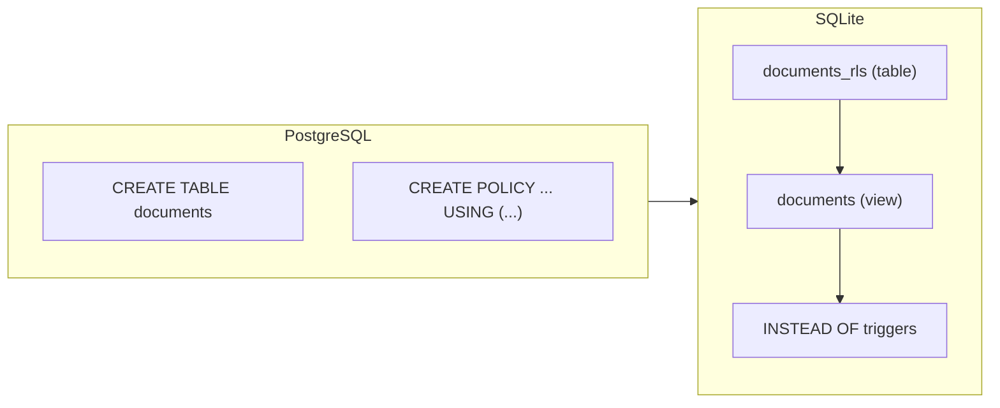

# pg2sqlite

[](https://github.com/LucaCappelletti94/pg2sqlite/actions)
[](https://github.com/LucaCappelletti94/pg2sqlite/actions)
[](https://opensource.org/licenses/MIT)
[](https://codecov.io/gh/LucaCappelletti94/pg2sqlite)

A Rust library that translates PostgreSQL SQL into SQLite-compatible SQL.

It parses PostgreSQL-dialect statements using [`sqlparser`](https://github.com/apache/datafusion-sqlparser-rs) and emits semantically equivalent SQLite SQL, handling data type conversions, syntax differences, and advanced features like Row-Level Security, text search, pgvector, and PL/pgSQL triggers.

## Quick start

```rust
use pg2sqlite::prelude::*;

fn main() -> Result<(), Box<dyn std::error::Error>> {
    let pg_sql = "
        CREATE TABLE users (
            id SERIAL PRIMARY KEY,
            username TEXT NOT NULL
        );
        INSERT INTO users (username) VALUES ('alice') ON CONFLICT DO NOTHING;
    ";

    let sqlite_statements = Pg2Sqlite::default()
        .sql(pg_sql)?
        .translate(&Pg2SqliteOptions::default())?;

    assert_eq!(sqlite_statements.len(), 2);
    assert_eq!(
        sqlite_statements[0].to_string(),
        "CREATE TABLE users (id INTEGER PRIMARY KEY NOT NULL, username TEXT NOT NULL) STRICT"
    );
    assert_eq!(
        sqlite_statements[1].to_string(),
        "INSERT OR IGNORE INTO users (username) VALUES ('alice')"
    );

    Ok(())
}
```

## Features

### Statement translation

| PostgreSQL | SQLite |
|---|---|
| `CREATE TABLE` | Translated with `STRICT` mode and automatic type mapping |
| `CREATE INDEX` | Translated (including `CREATE INDEX IF NOT EXISTS`) |
| `CREATE TRIGGER` | PL/pgSQL function bodies are translated to SQLite trigger syntax |
| `CREATE VIEW` | Pass-through |
| `INSERT` | `ON CONFLICT DO NOTHING` becomes `OR IGNORE` |
| `UPDATE` / `DELETE` | Including `DELETE ... USING` syntax |
| `DROP TABLE` / `DROP VIEW` / `DROP INDEX` | Strips `CASCADE` / `RESTRICT` |
| `ALTER TABLE ENABLE ROW LEVEL SECURITY` | Translated to views + `INSTEAD OF` triggers (see [RLS](#row-level-security)) |
| `CREATE POLICY` / `CREATE ROLE` / `GRANT` / `REVOKE` | Consumed for RLS and grant-based filtering |

Statements without a SQLite equivalent (`CREATE FUNCTION`, `CREATE EXTENSION`, `CREATE SEQUENCE`, `ALTER ROLE`, `COPY`, etc.) are silently skipped.

### Type mapping

| PostgreSQL | SQLite |
|---|---|
| `SERIAL` / `SMALLSERIAL` / `SMALLINT` / `INT` / `BOOLEAN` | `INTEGER` |
| `FLOAT` / `DOUBLE PRECISION` | `REAL` |
| `VARCHAR` / `JSON` / `JSONB` / `TIMESTAMP` / `TIMESTAMPTZ` | `TEXT` |
| `UUID` | `BLOB` or `TEXT` (configurable) |
| `BYTEA` / `GEOGRAPHY` | `BLOB` |
| `vector(N)` / `halfvec(N)` | `BLOB` (see [Vector search](#vector-search)) |

All `CREATE TABLE` output uses SQLite `STRICT` mode, and `NOT NULL` is automatically added to primary key columns.

### UUID generation

PostgreSQL UUID defaults (`gen_random_uuid()`, `uuidv4()`, `uuidv7()`) are translated to a configurable SQLite function call. Both `BLOB` (16 bytes) and `TEXT` (36 chars) representations are supported.

```rust
# use pg2sqlite::prelude::*;
let options = Pg2SqliteOptions::default()
    .with_uuid_representation(UuidRepresentation::Blob)
    .with_uuid_function_name("uuidv7".to_string());
```

### Row-Level Security

PostgreSQL RLS policies are translated to SQLite using views and `INSTEAD OF` triggers:

1. The original table is renamed with a configurable suffix (default: `_rls`)
2. A view with the original table name filters rows based on policy `USING` clauses
3. `INSTEAD OF` triggers enforce `INSERT`, `UPDATE`, and `DELETE` policies



PostgreSQL session variables are mapped to SQLite function calls:

| PostgreSQL | SQLite |
|---|---|
| `current_setting('app.user_id')` | `current_app_user()` (configurable) |
| `current_user` | `current_app_user()` (configurable) |

```rust
# use pg2sqlite::prelude::*;
let options = Pg2SqliteOptions::default()
    .with_session_variable(SessionVariableMapping::current_setting(
        "app.user_id",
        "current_app_user",
    ))
    .with_rls_audit_table_name("rls_violations".to_string());
```

### Grant-based filtering

When `with_session_user_role` is set, the translation output is tailored to that role's permissions:

| Grants to role | Result |
|---|---|
| None | Table skipped entirely (server-only) |
| `SELECT` only | Table + view, no write triggers (read-only) |
| Full CRUD | Table + view + `INSTEAD OF` triggers |

```rust
# use pg2sqlite::prelude::*;
let options = Pg2SqliteOptions::default()
    .with_session_user_role("app_user");
```

This is useful for generating SQLite schemas for client-side replicas that should only see and modify data they are authorized to access.

### Vector search

Translates [pgvector](https://github.com/pgvector/pgvector) types and operators to [sqlite-vec](https://github.com/asg017/sqlite-vec) equivalents:

| PostgreSQL | sqlite-vec |
|---|---|
| `<->` (L2 distance) | `vec_distance_L2()` |
| `<=>` (cosine distance) | `vec_distance_cosine()` |
| `'[1,2,3]'::vector` | `vec_f32('[1,2,3]')` |

For tables with vector columns, pg2sqlite additionally generates a `vec0` virtual table and sync triggers (`INSERT`, `UPDATE`, `DELETE`) to keep it synchronized with the main table.

### PL/pgSQL trigger translation

PL/pgSQL trigger function bodies are translated to SQLite trigger syntax, supporting:

- Variable declarations and assignments
- `IF` / `ELSIF` / `ELSE` conditionals
- `SELECT INTO` variable binding
- `NEW` / `OLD` record references
- `RAISE EXCEPTION` to `SELECT RAISE(ABORT, ...)`

### Reverse translation

pg2sqlite can also translate SQLite DML statements (`INSERT`, `UPDATE`, `DELETE`, `SELECT`) back to PostgreSQL, which is useful for client-side replicas that need to sync changes back to a PostgreSQL server.

```rust
# use pg2sqlite::prelude::*;
# fn main() -> Result<(), Box<dyn std::error::Error>> {
let translator = Pg2Sqlite::default()
    .sql("CREATE TABLE users (id UUID PRIMARY KEY, name TEXT);")?;
let schema = translator.build_schema()?;
let options = Pg2SqliteOptions::default();

let pg_stmts = translator.reverse_sql(
    "SELECT * FROM users; INSERT INTO users VALUES ('abc', 'test');",
    &schema,
    &options,
)?;
assert_eq!(pg_stmts.len(), 2);
# Ok(())
# }
```

### Migration loading

| Method | Description |
|---|---|
| `.sql(str)` | Parse a SQL string |
| `.file(path)` | Read and parse a SQL file |
| `Pg2Sqlite::ups(dir)` | Recursively load all `up.sql` migration files (sorted) |
| `Pg2Sqlite::ups_until(dir, stop)` | Load migrations up to a specific file |
| `Pg2Sqlite::from_git(url)` | Clone a git repository and load its `up.sql` migrations |

## Full RLS example

```rust
use pg2sqlite::prelude::*;

fn main() -> Result<(), Box<dyn std::error::Error>> {
    let pg_sql = "
        CREATE TABLE documents (
            id UUID PRIMARY KEY DEFAULT uuidv7(),
            owner_id UUID NOT NULL,
            title TEXT NOT NULL
        );
        ALTER TABLE documents ENABLE ROW LEVEL SECURITY;
        CREATE POLICY documents_select ON documents
            FOR SELECT USING (owner_id = current_setting('app.user_id')::uuid);
        CREATE POLICY documents_insert ON documents
            FOR INSERT WITH CHECK (owner_id = current_setting('app.user_id')::uuid);
    ";

    let options = Pg2SqliteOptions::default()
        .with_uuid_representation(UuidRepresentation::Blob)
        .with_uuid_function_name("uuidv7".to_string())
        .with_session_user_role("authenticated")
        .with_session_variable(SessionVariableMapping::current_setting(
            "app.user_id",
            "current_app_user",
        ))
        .with_rls_audit_table_name("rls_violations".to_string());

    let sqlite_statements = Pg2Sqlite::default()
        .sql(pg_sql)?
        .translate(&options)?;

    // Produces:
    // 1. CREATE TABLE documents_rls (...) STRICT
    // 2. CREATE VIEW documents AS SELECT ... FROM documents_rls
    //    WHERE owner_id = current_app_user()
    // 3. CREATE TRIGGER ... INSTEAD OF INSERT ON documents ...
    // 4. CREATE TRIGGER ... INSTEAD OF DELETE ON documents ...

    Ok(())
}
```

## License

This project is licensed under the [MIT License](https://opensource.org/licenses/MIT).
