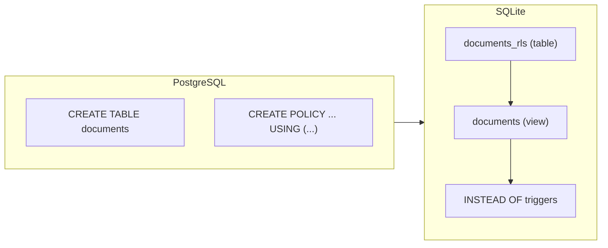

# pg2sqlite

[](https://github.com/LucaCappelletti94/pg2sqlite/actions)
[](https://github.com/LucaCappelletti94/pg2sqlite/actions)
[](https://opensource.org/licenses/MIT)
[](https://codecov.io/gh/LucaCappelletti94/pg2sqlite)

A Rust library that translates PostgreSQL SQL into valid, runnable SQLite SQL.

It parses PostgreSQL-dialect statements using [`sqlparser`](https://github.com/apache/datafusion-sqlparser-rs) and emits semantically equivalent SQLite SQL. Beyond basic type and syntax rewriting it handles complex PostgreSQL features that have no direct SQLite counterpart:

- **Row-Level Security** — `CREATE POLICY` / `ALTER TABLE … ENABLE ROW LEVEL SECURITY` is translated to a renamed backing table, a view that enforces the `USING` clause, and `INSTEAD OF` triggers.
- **Full-text search** — `CREATE INDEX … USING GIN (to_tsvector(…))` becomes an FTS5 virtual table with `AFTER INSERT / DELETE / UPDATE` sync triggers.
- **Vector search** — pgvector types (`vector`, `halfvec`) and distance operators (`<->`, `<=>`) are translated to [sqlite-vec](https://github.com/asg017/sqlite-vec) equivalents, including a `vec0` virtual table and sync triggers.
- **PL/pgSQL triggers** — trigger function bodies are parsed and rewritten to SQLite trigger syntax, including `IF / ELSIF / ELSE`, `SELECT INTO`, `RAISE EXCEPTION`, and `NEW` / `OLD` references.
- **Grant-based filtering** — when a session role is configured, tables and indices the role cannot access are omitted from the output entirely.
- **Reverse translation** — SQLite DML (`INSERT`, `UPDATE`, `DELETE`, `SELECT`) can be translated back to PostgreSQL for syncing client-side replicas to a PostgreSQL server.

> [!IMPORTANT]
> **Translation guarantees:** every output statement is valid SQLite. If a construct can be translated, it is; if it cannot, the call returns an explicit `Err`. *Silently skipped* statements (`CREATE FUNCTION`, `GRANT`, `CREATE ROLE`, …) carry no SQLite-representable information; *silently dropped* column options (`COLLATION`, `CHARACTER SET`, `COMMENT`) have no SQLite equivalent. Everything else either translates or errors — there are no silent pass-throughs that look valid but fail at runtime.

## Quick start

```rust
use pg2sqlite::prelude::*;

fn main() -> Result<(), Box<dyn std::error::Error>> {
    let pg_sql = "
        CREATE TABLE users (
            id SERIAL PRIMARY KEY,
            username TEXT NOT NULL
        );
        INSERT INTO users (username) VALUES ('alice') ON CONFLICT DO NOTHING;
    ";

    let sqlite_statements = Pg2Sqlite::default()
        .sql(pg_sql)?
        .translate(&Pg2SqliteOptions::default())?;

    assert_eq!(sqlite_statements.len(), 2);
    assert_eq!(
        sqlite_statements[0].to_string(),
        "CREATE TABLE users (id INTEGER PRIMARY KEY NOT NULL, username TEXT NOT NULL) STRICT"
    );
    assert_eq!(
        sqlite_statements[1].to_string(),
        "INSERT OR IGNORE INTO users (username) VALUES ('alice')"
    );

    Ok(())
}
```

## Features

### Statement translation

| PostgreSQL                                             | SQLite                                                                             |
| ------------------------------------------------------ | ----------------------------------------------------------------------------------- |
| `CREATE TABLE`                                         | Translated with `STRICT` mode and automatic type mapping                            |
| `CREATE INDEX`                                         | Translated (including `CREATE INDEX IF NOT EXISTS`)                                 |
| `CREATE TRIGGER`                                       | PL/pgSQL function bodies translated to SQLite trigger syntax                        |
| `CREATE VIEW`                                          | Translated; `CREATE OR REPLACE VIEW` becomes `DROP VIEW IF EXISTS` + `CREATE VIEW`  |
| `INSERT`                                               | `ON CONFLICT DO NOTHING` → `OR IGNORE`; `ON CONFLICT DO UPDATE SET …` preserved as SQLite upsert (SQLite ≥ 3.24) |
| `UPDATE` / `DELETE`                                    | Including `DELETE ... USING` syntax                                                 |
| `DROP TABLE` / `DROP VIEW` / `DROP INDEX`              | Strips `CASCADE` / `RESTRICT`                                                       |
| `ALTER TABLE ENABLE ROW LEVEL SECURITY`                | Translated to views + `INSTEAD OF` triggers (see [RLS](#row-level-security))        |
| `CREATE POLICY` / `CREATE ROLE` / `GRANT` / `REVOKE`   | Consumed for RLS and grant-based filtering; no invalid output emitted               |

Statements with no SQLite equivalent (`CREATE FUNCTION`, `CREATE EXTENSION`, `CREATE SEQUENCE`, `ALTER ROLE`, `COPY`, etc.) are silently skipped — they carry no information that can be represented in SQLite.

Statements that *do* have a SQLite equivalent but that pg2sqlite does not yet translate (`STDDEV`, `PERCENTILE_CONT`, `ARRAY_AGG`, `REGEXP_REPLACE`, …) return an explicit `Err` with a descriptive message. A clear error is always better than output that silently computes the wrong result or fails at runtime.

### Type mapping

| PostgreSQL                                                   | SQLite                                        |
| ------------------------------------------------------------ | --------------------------------------------- |
| `SERIAL` / `SMALLSERIAL` / `SMALLINT` / `INT` / `BOOLEAN`    | `INTEGER`                                     |
| `BIGINT` / `INT8` / `INT4` / `INT2`                          | `INTEGER`                                     |
| `FLOAT` / `DOUBLE PRECISION` / `FLOAT8` / `FLOAT4`           | `REAL`                                        |
| `NUMERIC` / `DECIMAL`                                        | `REAL` (lossy — precision not enforced)       |
| `VARCHAR` / `CHAR` / `TEXT` / `CLOB` / `NVARCHAR`            | `TEXT`                                        |
| `JSON` / `JSONB` / `TSVECTOR` / `TSQUERY`                    | `TEXT`                                        |
| `TIMESTAMP` / `TIMESTAMPTZ` / `DATE` / `TIME` / `INTERVAL`   | `TEXT`                                        |
| `UUID`                                                       | `BLOB` or `TEXT` (configurable)               |
| `BYTEA` / `BINARY` / `VARBINARY` / `GEOGRAPHY`               | `BLOB`                                        |
| `BIT` / `BIT VARYING`                                        | `INTEGER`                                     |
| `vector(N)` / `halfvec(N)`                                   | `BLOB` (see [Vector search](#vector-search))  |

All `CREATE TABLE` output uses SQLite `STRICT` mode, and `NOT NULL` is automatically added to primary key columns.

### Function translation

| PostgreSQL                         | SQLite                                                   |
| ---------------------------------- | -------------------------------------------------------- |
| `NOW()`                            | `datetime('now')`                                        |
| `CURRENT_TIMESTAMP`                | `CURRENT_TIMESTAMP` (SQLite keyword, preserved as-is)    |
| `EXTRACT(YEAR FROM x)`             | `CAST(strftime('%Y', x) AS INTEGER)`                     |
| `EXTRACT(EPOCH FROM x)`            | `CAST(strftime('%s', x) AS REAL)`                        |
| `DATE_TRUNC('month', x)`           | `strftime('%Y-%m-01', x)`                                |
| `CONCAT(a, b, c)`                  | `COALESCE(a,'') \|\| COALESCE(b,'') \|\| COALESCE(c,'')` |
| `STRING_AGG(x, sep)`               | `GROUP_CONCAT(x, sep)`                                   |
| `JSON_AGG(x)` / `JSONB_AGG(x)`     | `json_group_array(x)`                                    |
| `JSON_OBJECT_AGG(k, v)`            | `json_group_object(k, v)`                                |
| `CHAR_LENGTH(x)`                   | `length(x)`                                              |
| `STRPOS(s, sub)`                   | `instr(s, sub)`                                          |
| `POSITION(sub IN s)`               | `instr(s, sub)`                                          |
| `SUBSTRING(s FROM n FOR l)`        | `substr(s, n, l)`                                        |
| `ILIKE`                            | `lower(x) LIKE lower(pattern)`                           |
| `data->'field'` / `data->>'field'` | Preserved as-is (SQLite ≥ 3.38 native JSON operators)    |
| `x IS DISTINCT FROM y`             | `NOT (x IS y)`                                           |
| `x IS NOT DISTINCT FROM y`         | `x IS y`                                                 |

### Limitations

| Category                        | Examples                                                                         | Behavior                                             |
| ------------------------------- | -------------------------------------------------------------------------------- | ---------------------------------------------------- |
| Untranslatable SQL              | `STDDEV`, `PERCENTILE_CONT`, `ARRAY_AGG`, `REGEXP_REPLACE`, `#>`, `#>>`         | Returns `Err` with a descriptive message             |
| Silently skipped statements     | `CREATE FUNCTION`, `CREATE EXTENSION`, `CREATE SEQUENCE`, `GRANT`, `REVOKE`, `CREATE ROLE`, `COPY` | Silently omitted — carry no SQLite-representable information |
| Silently dropped column options | `COLLATION`, `CHARACTER SET`, `COMMENT`                                          | Dropped — no SQLite equivalent                       |

### UUID generation

**UUID translation requires explicit configuration.** Without `.with_uuid_representation()`, UUID columns default to `BLOB` (16 bytes); use `UuidRepresentation::Text` for 36-character strings. UUID default functions (`gen_random_uuid()`, `uuidv7()`, …) are renamed to the function configured via `.with_uuid_function_name()`.

PostgreSQL UUID defaults (`gen_random_uuid()`, `uuidv4()`, `uuidv7()`) are translated to a configurable SQLite function call. Both `BLOB` (16 bytes) and `TEXT` (36 chars) representations are supported.

```rust
use pg2sqlite::prelude::*;
let options = Pg2SqliteOptions::default()
    .with_uuid_representation(UuidRepresentation::Blob)
    .with_uuid_function_name("uuidv7".to_string());
```

### Row-Level Security

PostgreSQL RLS policies are translated to SQLite using views and `INSTEAD OF` triggers:

1. The original table is renamed with a configurable suffix (default: `_rls`)
2. A view with the original table name filters rows based on policy `USING` clauses
3. `INSTEAD OF` triggers enforce `INSERT`, `UPDATE`, and `DELETE` policies



PostgreSQL session variables are mapped to SQLite function calls:

| PostgreSQL                       | SQLite                              |
| -------------------------------- | ----------------------------------- |
| `current_setting('app.user_id')` | `current_app_user()` (configurable) |
| `current_user`                   | `current_app_user()` (configurable) |

```rust
use pg2sqlite::prelude::*;
let options = Pg2SqliteOptions::default()
    .with_session_variable(SessionVariableMapping::current_setting(
        "app.user_id",
        "current_app_user",
    ))
    .with_rls_audit_table_name("rls_violations".to_string());
```

### Grant-based filtering

When `with_session_user_role` is set, the translation output is tailored to that role's permissions:

| Grants to role | Result                                      |
| -------------- | ------------------------------------------- |
| None           | Table skipped entirely (server-only)        |
| `SELECT` only  | Table + view, no write triggers (read-only) |
| Full CRUD      | Table + view + `INSTEAD OF` triggers        |

```rust
use pg2sqlite::prelude::*;
let options = Pg2SqliteOptions::default()
    .with_session_user_role("app_user");
```

This is useful for generating SQLite schemas for client-side replicas that should only see and modify data they are authorized to access.

### Vector search

Translates [pgvector](https://github.com/pgvector/pgvector) types and operators to [sqlite-vec](https://github.com/asg017/sqlite-vec) equivalents:

| PostgreSQL              | sqlite-vec                |
| ----------------------- | ------------------------- |
| `<->` (L2 distance)     | `vec_distance_L2()`       |
| `<=>` (cosine distance) | `vec_distance_cosine()`   |
| `'[1,2,3]'::vector`     | `vec_f32('[1,2,3]')`      |

For tables with vector columns, pg2sqlite additionally generates a `vec0` virtual table and sync triggers (`INSERT`, `UPDATE`, `DELETE`) to keep it synchronized with the main table.

### Full-text search

`CREATE INDEX … USING GIN (to_tsvector('english', body))` is translated to an FTS5 virtual table plus three sync triggers that keep it current:

```sql
-- Input (PostgreSQL)
CREATE TABLE docs (id INT PRIMARY KEY, body TEXT);
CREATE INDEX docs_fts ON docs USING GIN (to_tsvector('english', body));

-- Output (SQLite)
CREATE VIRTUAL TABLE docs_fts USING fts5(body, content=docs, content_rowid=id);
CREATE TRIGGER docs_fts_ai AFTER INSERT ON docs BEGIN
    INSERT INTO docs_fts(rowid, body) VALUES (new.id, new.body);
END;
-- ... UPDATE and DELETE triggers
```

### PL/pgSQL trigger translation

PL/pgSQL trigger function bodies are translated to SQLite trigger syntax, supporting:

- Variable declarations and assignments
- `IF` / `ELSIF` / `ELSE` conditionals
- `SELECT INTO` variable binding
- `NEW` / `OLD` record references
- `RAISE EXCEPTION` → `SELECT RAISE(ABORT, ...)`

### Reverse translation

pg2sqlite can also translate SQLite DML statements (`INSERT`, `UPDATE`, `DELETE`, `SELECT`) back to PostgreSQL, which is useful for client-side replicas that need to sync changes back to a PostgreSQL server.

```rust
use pg2sqlite::prelude::*;
fn main() -> Result<(), Box<dyn std::error::Error>> {
let translator = Pg2Sqlite::default()
    .sql("CREATE TABLE users (id UUID PRIMARY KEY, name TEXT);")?;
let schema = translator.build_schema()?;
let options = Pg2SqliteOptions::default();

let pg_stmts = translator.reverse_sql(
    "SELECT * FROM users; INSERT INTO users VALUES ('abc', 'test');",
    &schema,
    &options,
)?;
assert_eq!(pg_stmts.len(), 2);
Ok(())
}
```

### Migration loading

| Method                              | Description                                                  |
| ----------------------------------- | ------------------------------------------------------------ |
| `.sql(str)`                         | Parse a SQL string                                           |
| `.file(path)`                       | Read and parse a SQL file                                    |
| `Pg2Sqlite::ups(dir)`               | Recursively load all `up.sql` migration files (sorted)       |
| `Pg2Sqlite::ups_until(dir, stop)`   | Load migrations up to a specific file                        |
| `Pg2Sqlite::from_git(url)`          | Clone a git repository and load its `up.sql` migrations      |

## Full RLS example

```rust
use pg2sqlite::prelude::*;

fn main() -> Result<(), Box<dyn std::error::Error>> {
    let pg_sql = "
        CREATE TABLE documents (
            id UUID PRIMARY KEY DEFAULT uuidv7(),
            owner_id UUID NOT NULL,
            title TEXT NOT NULL
        );
        ALTER TABLE documents ENABLE ROW LEVEL SECURITY;
        CREATE POLICY documents_select ON documents
            FOR SELECT USING (owner_id = current_setting('app.user_id')::uuid);
        CREATE POLICY documents_insert ON documents
            FOR INSERT WITH CHECK (owner_id = current_setting('app.user_id')::uuid);
    ";

    let options = Pg2SqliteOptions::default()
        .with_uuid_representation(UuidRepresentation::Blob)
        .with_uuid_function_name("uuidv7".to_string())
        .with_session_user_role("authenticated")
        .with_session_variable(SessionVariableMapping::current_setting(
            "app.user_id",
            "current_app_user",
        ))
        .with_rls_audit_table_name("rls_violations".to_string());

    let sqlite_statements = Pg2Sqlite::default()
        .sql(pg_sql)?
        .translate(&options)?;

    // Produces:
    // 1. CREATE TABLE documents_rls (...) STRICT
    // 2. CREATE VIEW documents AS SELECT ... FROM documents_rls
    //    WHERE owner_id = current_app_user()
    // 3. CREATE TRIGGER ... INSTEAD OF INSERT ON documents ...
    // 4. CREATE TRIGGER ... INSTEAD OF DELETE ON documents ...

    Ok(())
}
```

## Performance

Measured with Criterion on an optimized release build (`cargo bench -- vs_polyglot`).
pg2sqlite performs full semantic translation; polyglot-sql performs syntactic rewriting.

| Input                 | pg2sqlite | polyglot-sql | speedup  |
| --------------------- | --------: | -----------: | -------: |
| `select_simple`       |  19.6 µs  |   56.7 µs    | **2.9×** |
| `select_join`         |  37.5 µs  |   69.5 µs    | **1.9×** |
| `select_subquery`     |  28.3 µs  |   62.9 µs    | **2.2×** |
| `select_cte`          |  33.8 µs  |   67.7 µs    | **2.0×** |
| `insert_simple`       |  16.0 µs  |   54.4 µs    | **3.4×** |
| `insert_on_conflict`  |  27.2 µs  |   65.6 µs    | **2.4×** |
| `update_multi_column` |  19.3 µs  |   60.9 µs    | **3.2×** |
| `delete_subquery`     |  25.4 µs  |   60.3 µs    | **2.4×** |
| `create_table_ddl`    |  24.3 µs  |   57.8 µs    | **2.4×** |

## Why pg2sqlite?

Most PostgreSQL-to-SQLite translators are best-effort: they pass unknown constructs through unchanged, silently drop arguments, or emit SQL that fails at runtime.  pg2sqlite takes the opposite stance:

| Behaviour                                           | pg2sqlite | polyglot-sql          | sqlglot               |
| --------------------------------------------------- | :-------: | :-------------------: | :-------------------: |
| Explicit `Err` for untranslatable constructs        | ✓         | ✗                     | partial               |
| PL/pgSQL trigger body translation                   | ✓         | ✗                     | ✗                     |
| Row-Level Security → view + triggers                | ✓         | ✗                     | ✗                     |
| GIN / GiST index → FTS5 virtual table               | ✓         | ✗                     | ✗                     |
| pgvector → sqlite-vec                               | ✓         | ✗                     | ✗                     |
| Reverse translation (SQLite → PostgreSQL)           | Only DML  | partial               | partial               |
| `GRANT` / `REVOKE` / `CREATE ROLE` silently skipped | ✓         | ✗ (emits invalid SQL) | ✗ (emits invalid SQL) |

See [`cargo run --example compare_polyglot`](examples/compare_polyglot.rs) for a full side-by-side comparison across 80+ test cases including runtime execution checks.

## License

This project is licensed under the [MIT License](https://opensource.org/licenses/MIT).
